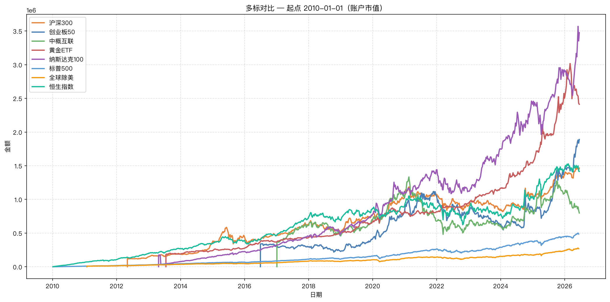
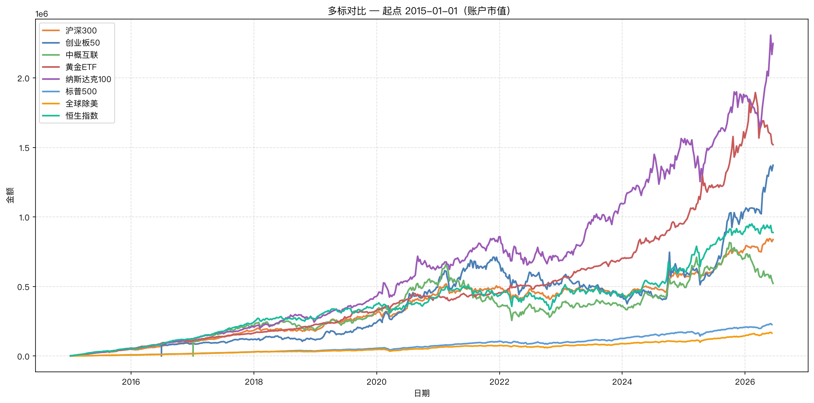
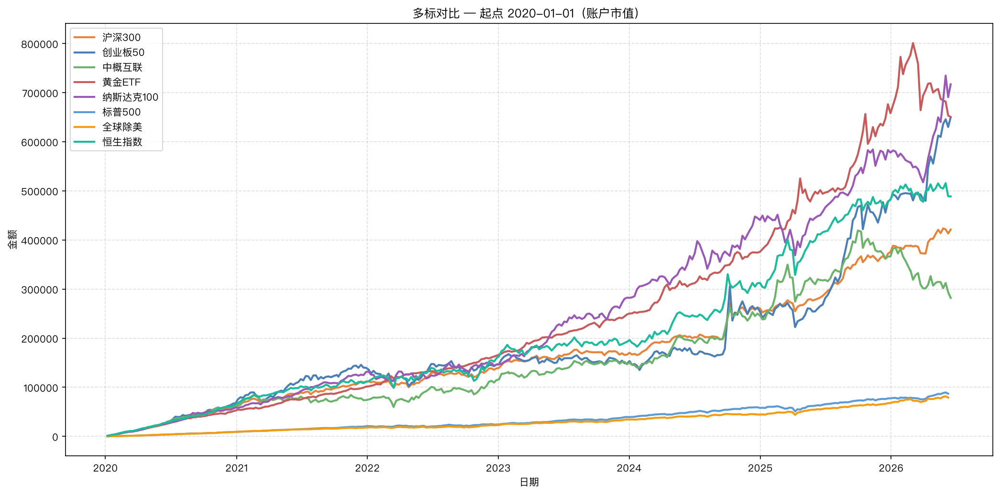
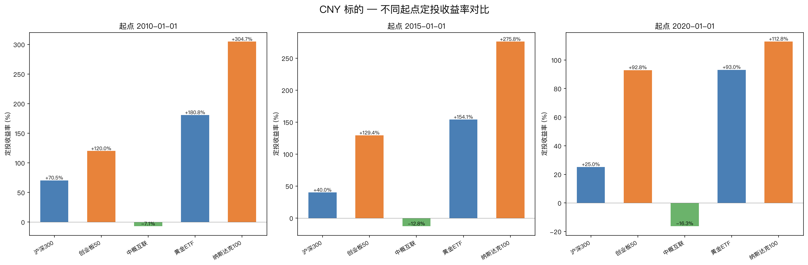
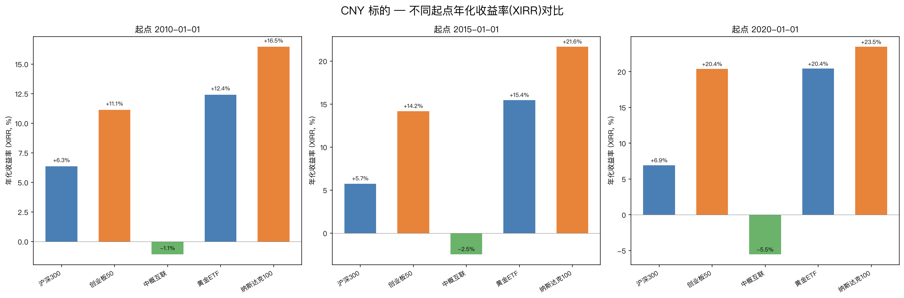
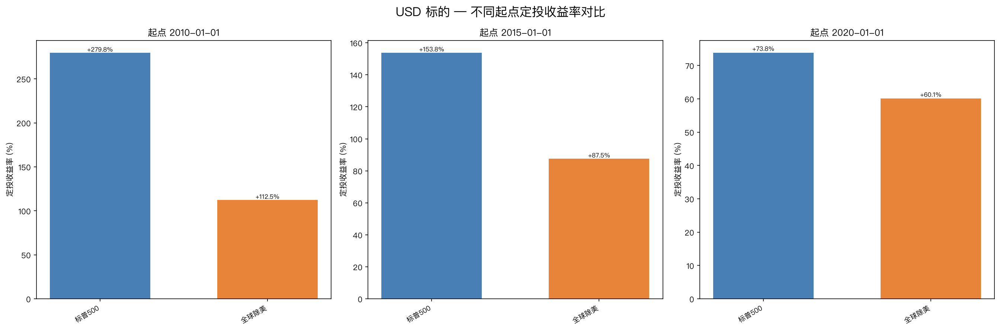
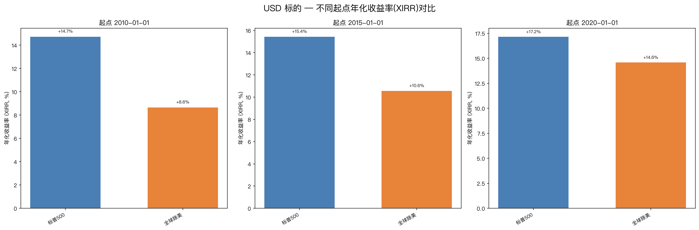
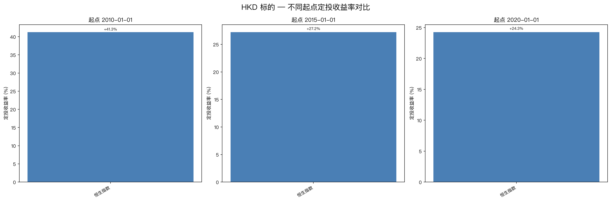
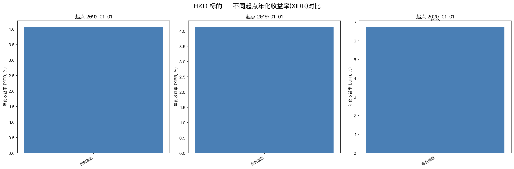

# 多起点定投策略对比分析

> **回测区间**：2010-01-01 / 2015-01-01 / 2020-01-01 → 2026-06-16  
> **定投频率**：每周二 · 费率 0.1%  
> **投入金额**：CNY 标的 1000 元/周 · USD 标的 150 美元/周 · HKD 标的 1,167 港币/周  
> **数据来源**：Yahoo Finance

---

## 📂 项目文件索引

| 文件 | 说明 |
|------|------|
| [`analyze.py`](./analyze.py) | 完整分析脚本（数据拉取 → 回测 → 图表 → HTML 报告全流程） |
| [`summary.csv`](./summary.csv) | 24 组回测的汇总数据表 |
| [`notes.md`](./notes.md) | 研究过程记录 |
| [`index.html`](./index.html) | **自包含的 HTML 报告**（内嵌全部 33 张图表，浏览器直接打开） |
| [`charts/`](./charts/) | 33 张图表目录 |
| [`charts/comparison_*.png`](./charts/comparison_2010-01-01.png) | 多标对比曲线图（按起点分组，3 张） |
| [`charts/bar_comparison_*.png`](./charts/bar_comparison_CNY.png) | 定投收益率柱状图（按货币分组，3 张） |
| [`charts/xirr_comparison_*.png`](./charts/xirr_comparison_CNY.png) | 年化收益率(XIRR)柱状图（按货币分组，3 张） |
| [`charts/curve_*.png`](./charts/curve_csi300_2010-01-01.png) | 各标的×起点的收益曲线图（24 张） |

> 💡 **推荐阅读顺序**：先看 `index.html` 获取完整视图，再查阅 `summary.csv` 获取精确数据。

---

## 📋 回测结果汇总

### 🇨🇳 人民币标的 — 每周 1,000 元

| 标的 | 起点 | 定投次数 | 总投入 | 期末总值 | 定投收益率 | 年化(XIRR) | 一次性投入 |
|------|:---:|:-------:|------:|---------:|:---------:|:----------:|:----------:|
| **沪深300** | 2010 | 859 | 859,000 | 1,464,464 | **+70.48%** | +6.34% | +126.04% |
| | 2015 | 598 | 598,000 | 837,218 | **+40.00%** | +5.74% | +63.88% |
| | 2020 | 337 | 337,000 | 421,405 | **+25.05%** | +6.93% | +32.35% |
| **创业板50** | 2010 | 859 | 859,000 | 1,889,748 | **+119.99%** | +11.12% | +98.60% |
| | 2015 | 598 | 598,000 | 1,371,920 | **+129.42%** | +14.16% | +98.60% |
| | 2020 | 337 | 337,000 | 649,858 | **+92.84%** | +20.38% | +189.50% |
| **中概互联** ⚠️ | 2010 | 859 | 859,000 | 798,108 | **-7.09%** | -1.09% | +6.00% |
| | 2015 | 598 | 598,000 | 521,725 | **-12.76%** | -2.48% | +6.00% |
| | 2020 | 337 | 337,000 | 282,004 | **-16.32%** | -5.55% | -28.09% |
| **黄金ETF** | 2010 | 859 | 859,000 | 2,412,460 | **+180.85%** | +12.41% | +237.93% |
| | 2015 | 598 | 598,000 | 1,519,565 | **+154.11%** | +15.44% | +267.52% |
| | 2020 | 337 | 337,000 | 650,561 | **+93.04%** | +20.41% | +158.19% |
| **纳斯达克100** 🏆 | 2010 | 859 | 859,000 | 3,476,233 | **+304.68%** | +16.45% | +128.00% |
| | 2015 | 598 | 598,000 | 2,247,416 | **+275.82%** | +21.65% | +745.07% |
| | 2020 | 337 | 337,000 | 717,126 | **+112.80%** | +23.46% | +250.02% |

### 🇺🇸 美元标的 — 每周 150 美元

| 标的 | 起点 | 定投次数 | 总投入 | 期末总值 | 定投收益率 | 年化(XIRR) | 一次性投入 |
|------|:---:|:-------:|------:|---------:|:---------:|:----------:|:----------:|
| **标普500 (SPY)** | 2010 | 858 | 128,700 | 488,740 | **+279.75%** | +14.72% | +772.43% |
| | 2015 | 597 | 89,550 | 227,279 | **+153.80%** | +15.43% | +348.24% |
| | 2020 | 336 | 50,400 | 87,615 | **+73.84%** | +17.16% | +151.50% |
| **全球除美 (VXUS)** | 2010 | 858 | 128,700 | 273,426 | **+112.45%** | +8.65% | +173.81% |
| | 2015 | 597 | 89,550 | 167,919 | **+87.51%** | +10.55% | +155.36% |
| | 2020 | 336 | 50,400 | 80,675 | **+60.07%** | +14.59% | +85.72% |

### 🇭🇰 港股标的 — 每周 1,167 港币

| 标的 | 起点 | 定投次数 | 总投入 | 期末总值 | 定投收益率 | 年化(XIRR) | 一次性投入 |
|------|:---:|:-------:|------:|---------:|:---------:|:----------:|:----------:|
| **恒生指数 (2800.HK)** | 2010 | 859 | 1,002,453 | 1,416,001 | **+41.25%** | +4.06% | +72.10% |
| | 2015 | 598 | 697,866 | 887,803 | **+27.22%** | +4.13% | +52.95% |
| | 2020 | 337 | 393,279 | 488,709 | **+24.27%** | +6.73% | +7.23% |

---

## 📈 图表一览

### 多标对比曲线（按起点）

| 起点 | 预览 | 图表文件 |
|:---:|:----|:--------:|
| 2010-01-01 |  | `charts/comparison_2010-01-01.png` |
| 2015-01-01 |  | `charts/comparison_2015-01-01.png` |
| 2020-01-01 |  | `charts/comparison_2020-01-01.png` |

### 收益率/年化收益率柱状图

| 货币组 | 定投收益率 | 年化收益率(XIRR) |
|:-----:|:----------:|:----------------:|
| CNY |  |  |
| USD |  |  |
| HKD |  |  |

### 各标的收益曲线（24 张）

每个标的×起点的投入成本 vs 账户市值曲线图，详见 [`charts/`](./charts/) 目录。

---

## 💡 核心发现

### 1. 起点的选择远比想象中重要

| 起点 | 平均定投收益率 | 平均年化(XIRR) | 正收益比例 |
|:---:|:-------------:|:--------------:|:----------:|
| 2010-01-01 | **+112.7%** | +9.1% | 7/8 (88%) |
| 2015-01-01 | **+106.2%** | +10.6% | 7/8 (88%) |
| 2020-01-01 | +58.2% | **+12.4%** | 7/8 (88%) |

- 2010/2015 起步总收益更高，因为持有时长长、跨越多个周期
- 但 **2020 年起步的年化收益率反而最高**（12.4%），得益于近年市场的快速上涨
- 说明：**长期投资的复利价值不可忽视，但入场时机对年化影响显著**

### 2. 纳斯达克100 是全场冠军 🏆

国泰纳斯达克100ETF（513100.SS）三个起点均表现最佳：
- 2010 年起：**+304.68%**（总收益冠军）
- 2020 年起：**+23.46% 年化**（年化冠军）
- 人民币计价的 ETF 让国内投资者也能参与美股科技股

### 3. 中概互联是唯一的亏损标的

中概互联（513050.SS）三个起点均录得亏损，2020 年起最差 -16.32%。这反映了：
- 中概股近年受监管政策、地缘政治等因素的持续压力
- **即使定投摊平成本，在持续下跌的市场中也难逃亏损**
- 警示：选择标的时需关注行业基本面和政策环境

### 4. 黄金 — 稳健的压舱石

黄金ETF（518880.SS）表现稳定：
- 三个起点收益率在 +93% ~ +181% 之间
- 年化收益率在 12% ~ 20% 之间
- 与股票类资产相关性低，适合作为组合中的配置品种

### 5. 标普500 大幅跑赢全球除美

- 标普500 三个起点收益率 74% ~ 280%
- VXUS（全球除美股）三个起点收益率 60% ~ 112%
- 差距明显，反映了美股过去十余年相对于全球其他市场的强势表现

### 6. 定投 vs 一次性投入

| 对比 | 定投胜场 | 一次性投入胜场 |
|:---:|:--------:|:-------------:|
| 24 组 | 9 组 (38%) | 15 组 (62%) |

在 **62%** 的组中，期初一次性投入收益率更高。但定投的价值在于：
- **降低择时压力**：不需要精准判断市场底部
- **平滑波动**：在市场下跌时买入更多份额，市场回升时收益更可观
- **适合工资定投**：适合按月/按周从收入中持续投入的投资者

### 7. 恒生指数表现平淡

恒生指数（2800.HK）三个起点的收益率在 24% ~ 41% 之间，年化 4% ~ 7%，是本次分析中表现最弱的发达市场指数。

---

## 🛠 技术说明

- **复权价格**：使用 Yahoo Finance 的 `auto_adjust=True`，已折算分红/拆股（红利再投资）
- **定投日期顺延**：若周二为非交易日，自动顺延到下一个交易日
- **XIRR 计算**：使用牛顿法求解现金流内部收益率，考虑每笔资金的时间价值
- **图表**：使用 matplotlib 生成，配置中文字体（PingFang SC）
- **已知问题**：Yahoo Finance 有时在最后一个交易日返回 NaN 值，已通过 `dropna()` 处理

---

*报告生成时间：2026-06-16 · 数据源：Yahoo Finance · 分析工具：finance-data + dca-backtest skill*
